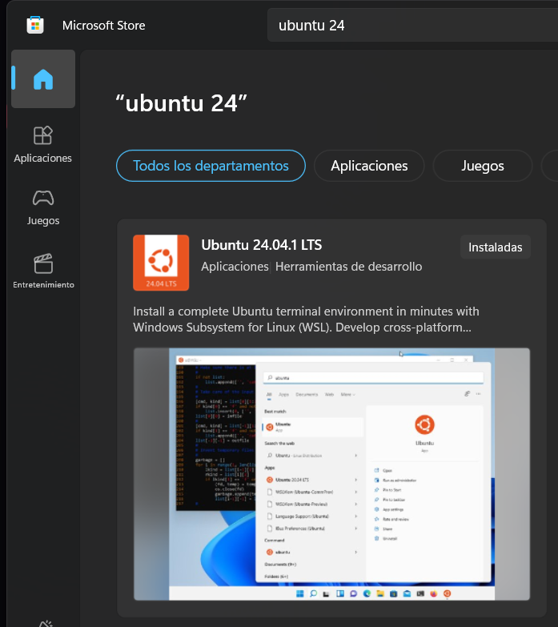
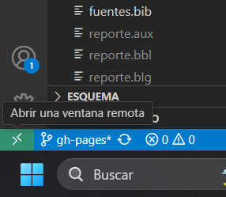

# Instalación de Ubuntu 24 en WSL

WSL (Windows Subsystem for Linux) permite usar el Kernel de linux dentro de windows, de forma que no tengas que cambiar de sistema operativo y sea mucho menos pesado. 

Existen varias formas de instalar Ubuntu. 
1. Desde la terminal de **PowerShell** con privilegios de administrador. Puedes abrir la aplicación **terminal** en Windows 11 para ello, aunque también se puede descargar desde la Microsoft Store. No es necesario, pero te permite abrir varias pestañas o seleccionar entre todas las terminales instaladas.
```powershell
wsl --install -d Ubuntu-24.04
```
2. Desde la Microsoft Store buscando Ubuntu 24:
   


3. Desde **Visual Studio Code**, presionando el botón con el símbolo [><]



Y seleccionando Conectar a WSL mediante distribución. Si nunca lo haz instalado, usa conectar a WSL y aparecerá una ventana que pide instalar una distribución, así que selecciona la que dice `Ubuntu 24.04 LTS`.


# ¿Quieres instalarlo en un lugar diferente al disco C?
1. Descarga la [imagen de Ubuntu 24.04](https://cloud-images.ubuntu.com/wsl/releases/24.04/current/ubuntu-noble-wsl-amd64-24.04lts.rootfs.tar.gz).
2. Importa la imagen a WSL2:
   * Abre PowerShell con privilegios de administrador.
   * Ejecuta el siguiente comando, reemplazando `D:\WSL\Ubuntu24` por la ruta donde deseas almacenar la nueva instancia (recuerda crear una nueva carpeta antes) y `C:\ruta\al\archivo\descargado.tar.gz` por la ruta al archivo que descargaste:
    ```powershell
    wsl --import Ubuntu-24 C:\WSL\Ubuntu24 C:\ruta\al\archivo\descargado.tar.gz --version 2
    ```
3. Inicia la nueva instancia:
   * Una vez importada, inicia la nueva distribución con:

    ```powershell
    wsl -d Ubuntu-24
    ```
   * Esto abrirá una terminal de la nueva instancia de Ubuntu 24 donde podrás realizar configuraciones adicionales según tus necesidades.
# ¿Aparece root en vez de tu usuario?

## **1. Crear un nuevo usuario**

Si al iniciar no te pide el usuario o ves que aparece `root` en la terminal, puedes seguir los siguientes pasos (recuerda cambiar `miusuario` por el usuario que creaste cada vez que aparezca).
1.  Crear un usuario escribiendo dentro de la terminal de Ubuntu:
```bash
adduser miusuario
```
* Cuando te pida contraseña y detalles, introdúcelos o presiona ENTER para omitir (La contraseña se oculta, así que no te asustes si parece que el teclado no funciona).

2. Agrega el usuario al grupo de **sudo** para que tenga permisos administrativos:
```bash
 usermod -aG sudo miusuario
```
## 2. Configurar el usuario de inicio
Para que Ubuntu 24 en WSL2 inicie directamente con el usuario nuevo en lugar de root, debes cambiar la configuración de WSL:
1. Ejecuta en **PowerShell**:
```powershell
wsl -d Ubuntu-24.04 --user miusuario
```
* Esto iniciará la sesión con el usuario `miusuario`

1. Comprueba dentro de Ubuntu si se seleccionó correctamente
## 3. Configurar usuario predeterminado
Si después de seguir los pasos anteriores sigue iniciando como **root**, prueba forzar el cambio manualmente editando el archivo `/etc/wsl.conf` **dentro de WSL**. Puedes abrir el explorador de archivos de Windows y abrir la carpeta `\\wsl.localhost\Ubuntu-24.04\etc` o en la terminal de Ubuntu, escribir:
```bash
sudo nano /etc/wsl.conf
```
Luego, agrega el siguiente contenido:
```ini
[user]
default=miusuario
```
Para guardar los cambios, presiona `Ctrl + X` (guardar), luego `Y` (aceptar) y ENTER (usar nombre actual). Entonces reinicia WSL en **PowerShell** con:
```powershell
wsl --shutdown
```
Vuelve a abrir Ubuntu 24 y verifica el usuario.

